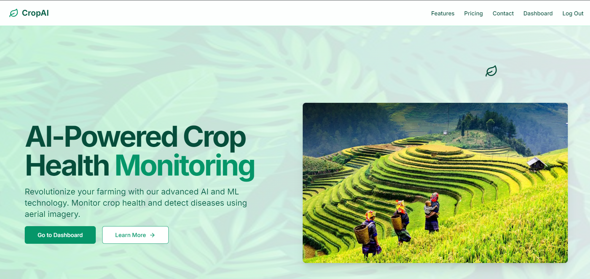
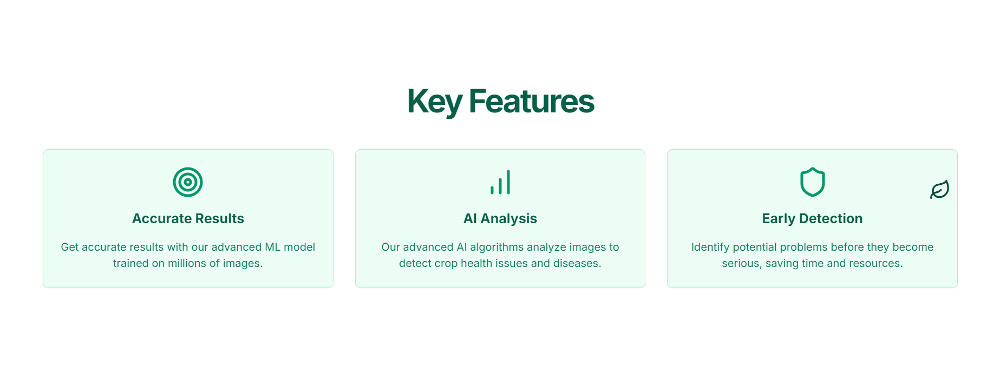
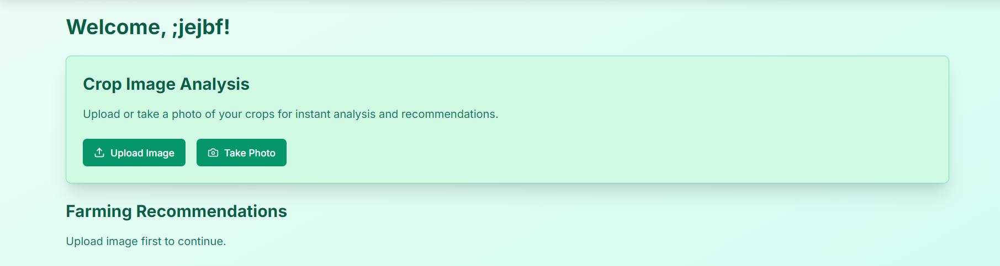

# CropAI
================

CropAI is an innovative AI-powered crop monitoring and management system designed to help farmers optimize crop yields and reduce losses.

## Overview
------------

CropAI is a comprehensive system that integrates AI-powered crop monitoring, field management, and sensor data processing to provide actionable insights for farmers. The system consists of a robust backend, a well-structured API, and a user-friendly frontend (currently under development).

## API and Backend
--------------------

The API and backend components of CropAI were developed by me Vishwesh Pal Saini. The API provides a robust interface for interacting with the CropAI system, while the backend handles data processing, analysis, and storage.

### API Endpoints

The CropAI API offers the following endpoints:

* **/crops**: Retrieve a list of supported crops
* **/fields**: Create, read, update, and delete field information
* **/sensors**: Register, update, and retrieve sensor data
* **/analytics**: Access crop analytics and insights
* **/ml**: Access machine learning models and predictions

### Backend Technology Stack

The CropAI backend is built using:

* **Python**: As the primary programming language
* **Django**: As the web framework
* **MySQL**: As the relational database management system
* **TensorFlow**: As the machine learning framework

### Machine Learning

The CropAI system utilizes machine learning algorithms to analyze sensor data and provide predictive insights on crop yields, disease detection, and weather patterns. The machine learning models are trained on a large dataset of crop-related information and are continuously updated to improve their accuracy.

## Features

* Crop monitoring and analysis
* Field management and optimization
* Sensor integration and data processing
* Data visualization and insights
* Machine learning-based predictive analytics

## Screenshots
-------------

Here are some screenshots of the CropAI system:

## Contributing

If you're interested in contributing to CropAI, please fork the repository and submit a pull request. We welcome contributions in the form of bug fixes, new features, and documentation improvements.

## License

CropAI is licensed under the MIT license.

## Acknowledgments

Special thanks to Madhav Mittal(https://github.com/msquarex) and Durvank Gade(https://github.com/DurvankGade) for initiating the CropAI project.
